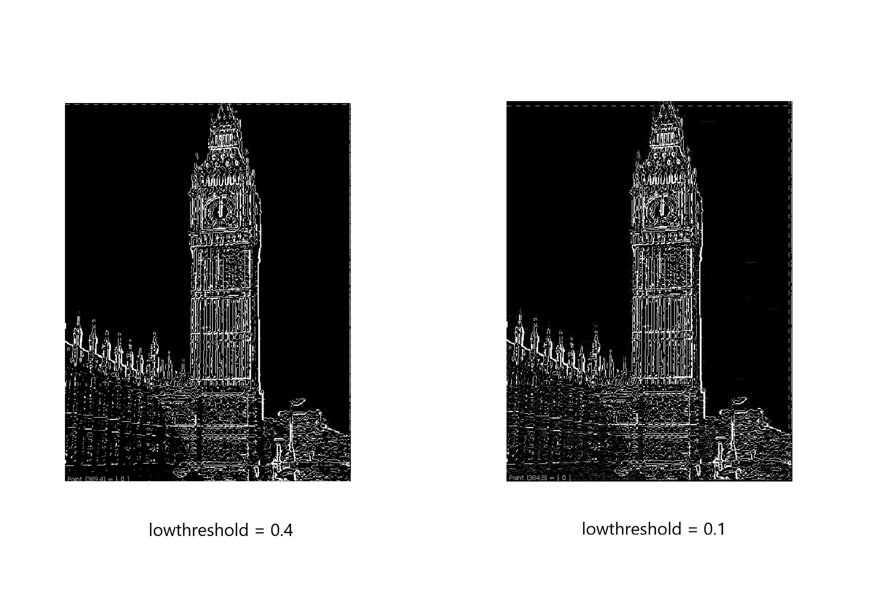

# 计算机视觉 - Homework2

### 姓名：陈明亮

### 学号：16340023

## 一、实验需求

#### 1. 通过阅读附件Canny边缘检测器代码，根据学号尾数除三取余，分别根据余数改写不同的Code(本人改写Code0)。

#### 2. 改写要求通过OOP思想封装成类，并且图像处理只依赖于CImg库，并要求代码封装接口简洁清晰。

#### 3. 在原来的代码基础上，增加对应函数：把相邻边缘连接成长线条，并删除长度小于20的Edge。

#### 4. 结合各项测试数据，对算法的若干组参数测试所有的图像，分析参数对结果的影响。


## 二、实验步骤解析

1. Gaussian-Smooth(高斯模糊)

   我们通过服从高斯分布的滤波器首先去除输入灰度图的噪声，通过公式$ S = G_\sigma * I$，计算模糊之后的图像，其中$G_\sigma$即为带有参数sigma的高斯滤波器。

2. Compute-Gradient(梯度计算)

   先通过计算X和Y方向上的偏导数矩阵，完成图像的梯度矩阵和偏差角度的计算，其中X和Y偏导数公式为：
   $$
   \Delta S = \begin{matrix} [ \frac \alpha { \alpha x } S & \frac \alpha { \alpha y } S ] ^ T \end{matrix}
   $$
   梯度计算的公式为：$|\Delta S| = \sqrt { {S^2_x} + {S^2_y}} $， $\theta = tan^{-1} \frac {S_y} {S_x}$

3. Non-maximal-suppression(非最大化抑制)

   NMS算法抑制不是极大值的元素，可以理解为局部最大搜索。这个局部代表的是一个邻域，邻域有两个参数可变，一是邻域的维数，二是邻域的大小。通过抑制弱边缘点，达到边缘检测去除弱边的效果。


4. Hysteresis-threshold(双阈值滞后)

   双阈值方法将某一像素点的梯度进行检测，高于高阈值者则声明其为边缘上的点，低于低阈值者否定其为边缘，介于双阈值者使用八邻阈方法进行周围强边缘的连接，连接成功即成为强点，否则去除。


## 三、实验过程

#### 1. 根据给定的四张jpg图片，将这些测试数据转换成bmp图像

方法：使用`ffmpeg`终端程序进行图片类型转换

代码：
```shell
$ ffmpeg -i .jpg .bmp
```


#### 2. 改写Code0代码，使用类封装结构化Canny边缘检测器

方法：结合面向对象的编程语言`C++`，将原本结构化架构的Code0内的各项函数都封装成类`Edge_detector`内部的成员方法，同时优化相应的处理步骤，明确每一步的相关操作，确定所需存储的变量作为类的内部成员。

代码：(Canny_edge_detector.h)

```c++
#ifndef CANNY_EDGE_DETECTOR_H
#define CANNY_EDGE_DETECTOR_H

#include "CImg.h"
#include <cmath>
#include <iostream>
#include <queue>
#include <vector>

#define abs(x) ( (x) >= 0 ? x : -x)
#define GAP_NUM 0.005f
#define MAG_SCALE 100.0f
#define MAG_LIMIT 1000.0f
#define MAG_MAX (MAG_SCALE * MAG_LIMIT)

using namespace cimg_library;
using namespace std;

class Edge_detector{
public:
	Edge_detector(CImg<unsigned char>& image, float sigma, float tlow, float thigh);
	~Edge_detector();
	// Startup of the edge detection
	CImg<unsigned char>& edge_detection();
	void gaussian_smooth();
	void compute_gradients();
	void no_max_supp(int iX, int mX, int iY, int mY, float* xGradient, float* yGradient);
	void apply_hysteresis();
	void follow_edges(int x, int y, int i);
	void remove_less20_edges();
	static void usage(char* name);

private:
	CImg<unsigned char> srcImg;
	CImg<unsigned char> edge;
	int height, width;
	float sigma, tlow, thigh;
	int *edgeImg, *mag;  // The edge image and magnitude array

	inline float hypo(float x, float y){
		return (float)sqrt(x*x + y*y);
	}
	inline float gauss(float x, float sig){
		return (float)exp(-(x*x) / (2.0 * sig *  sig));
	}
};

#endif
```

分析：结合图像边缘检测方法，我们基本上可以将从输入的灰度图 -> 输出的边缘图概括为以下四大步骤：

*  采用高斯滤波器平滑图像，清除噪声。

* 从横轴和纵轴方向分别计算灰度图像中每个像素的梯度矩阵。

* 使用非最大值抑制方法，消除残余杂点的噪声影响，优化边缘检测结果。

* 应用双阈值方法确定图像上的真实边缘与潜在边缘，同时去除弱点边缘，完成检测。


#### 3. Canny_edge_detector类中的成员方法分析

方法：结合原本给定的Code0，将对应的模块代码优化，修改Bug之后采用CImg库函数进行图像读写和数据处理。下面分别给出`Canny_edge_detector.cpp`内各个函数的实现，分析函数实现过程。

代码：(Canny_edge_detector.cpp)

1. 类构造函数 - Edge_detector()

   ```c++
   Edge_detector::Edge_detector(CImg<unsigned char>& image, float sigma_, float tlow_, float thigh_){
   	srcImg = image;
   	height = image.height();
   	width = image.width();
   	sigma = sigma_;
   	tlow = tlow_ * MAG_SCALE + 0.5f;
   	thigh = thigh_ * MAG_SCALE + 0.5f;
   }
   ```

   分析：构造函数接收对应的灰度图(Main.cpp中将bmp图像转换成灰度图)，同时接收命令行参数sigma, tlow, thigh, 意义分别是：高斯滤波器中的应用高斯函数的标准差，最低阈值和最高阈值。

   ​

2. 边缘检测启动函数 - edge_detection()

   ```c++
   CImg<unsigned char>& Edge_detector::edge_detection(){
   	// Allocate buffers
   	edgeImg = new int[width * height];
   	mag = new int[width * height];
   	/*****************************************
      	* Perform gaussian smoothing on the 
      	* image using the input standard deviation.
      	******************************************/
   	gaussian_smooth();

   	/******************************************
      	* Use sobel methods to find gradients
      	*******************************************/
      	compute_gradients();

       /******************************************
      	* Apply non-maximal-suppresion and hysteresis
      	*******************************************/
      	apply_hysteresis();

      	edge = CImg<unsigned char>(width, height, 1, 1, 0);
      	cimg_forXY(edge, x, y){
      		int tmp = y*width + x;
      		edge(x, y) = edgeImg[tmp] > 0 ? 255 : 0;
      	}
      	

      	remove_less20_edges();
      	edge.display();

      	edge.save("lenag.bmp");

      	return edge;

   }
   ```

   分析：边缘检测启动函数通过顺序调用类内部的接口，实现输入灰度图像的处理和保存输出。

   ​

3. 梯度计算函数 - compute_gradients() [部分代码]

   ```c++
   // Perform convolutions in x and y direction
   for(int x=iX; x<mX; x++){
       for(int y=iY; y<mY; y+=width){
           int tmp = x+y;
           float sumX = srcImg[tmp] * kernel[0];
           float sumY = sumX;
           int xOffset = 1;
           int yOffset = width;
           while (xOffset < i)
           {
               sumY += kernel[xOffset] * (srcImg[tmp - yOffset] + srcImg[tmp + yOffset]);
               sumX += kernel[xOffset] * (srcImg[tmp - xOffset] + srcImg[tmp + xOffset]);
               yOffset += width;
               xOffset++;
           }

           yConv[tmp] = sumY;
           xConv[tmp] = sumX;
       }
   }

   for (int x = iX; x < mX; x++){
       for (int y = iY; y < mY; y += width){
           float sum = 0.0f;
           int index = x + y;
           for (int j = 1; j < i; j++)
               sum += diffk[j] * (yConv[index - j] - yConv[index + j]);

           xGradient[index] = sum;
       }
   }

   for (int x = i; x < width - i; x++){
       for (int y = iY; y < mY; y += width){
           float sum = 0.0f;
           int index = x + y;
           int yOffset = width;
           for (int j = 1; j < i; j++){
               sum += diffk[j] * (xConv[index - yOffset] - xConv[index + yOffset]);
               yOffset += width;
           }

           yGradient[index] = sum;
       }
   }
   ```

   分析：建立梯度数组存储图像在x和y方向上的梯度变换，通过之前求解的高斯kernel，记录x，y方向上的卷积值，分别计算xGradient和yGradient。

   ​

4. 滞后双阈值方法函数 - apply_hysteresis()

   ```c++
   void Edge_detector::apply_hysteresis(){
   	int tmp = 0;
   	memset(edgeImg, 0, width*height*sizeof(int));

   	for(int x=0; x<height; x++){
   		for(int y=0; y<width; y++){
   			if(edgeImg[tmp] == 0 && mag[tmp] >= thigh)
   				follow_edges(y, x, tmp);
   			tmp++;
   		}
   	}
   }
   ```

   分析：采用follow_edges()方法连接边缘周围的，介于低阈值与高阈值之间的点，并且使其与原本的边缘连接，形成新的边缘。

   ​

5. 连接相邻的边缘函数 - follow_edges()

   ```c++
   void Edge_detector::follow_edges(int x, int y, int i){
       int x0 = x == 0 ? x : x - 1;
       int x1 = x == width - 1 ? x : x + 1;
       int y0 = y == 0 ? y : y - 1;
       int y1 = y == height - 1 ? y : y + 1;
       bool follow_flag = false, keep_flag = true;

       edgeImg[i] = mag[i];
       for (int j = x0; j <= x1; j++){
           for (int k = y0; k <= y1; k++){
               int tt = j + k * width;
               if ((k != y || j != x) && edgeImg[tt] == 0 && mag[tt] >= tlow){
               	follow_edges(j, k, tt);
               }
           }
       }
       
   }
   ```

   分析：采用八邻阈检测强点周围的非弱点，完成递归式的边缘点之间的连接操作。

   ​

6. 去除小于长度20的边缘函数 - remove_less20_edges()

   ```c++
   void Edge_detector::remove_less20_edges(){
   	queue<pair<int, int> > store;
   	CImg<bool> visited(srcImg.width(), srcImg.height(), 1, 1, 0);
   	for(int i=0; i<srcImg.width(); i++){
   		for(int j=0; j<srcImg.height(); j++){
   			if(visited(i, j) == true) continue;
   			store.push(make_pair(i, j));
   			vector<pair<int, int> > path;
   			while(!store.empty()){
   				int xx = store.front().first, yy = store.front().second;
   				path.push_back(make_pair(xx, yy));
   				store.pop();
   				for(int x=xx-1; x<xx+2; x++){
   					for(int y=yy-1; y<yy+2; y++){
   						if(x < 0 || y < 0 || x >= edge.width() || y >= edge.height())
   							continue;
   						else if(!visited(x, y) && edge(x, y) > 0){
   							store.push(make_pair(x, y));
   							visited(x, y) = true;
   						}
   					}
   				}
   			}
   			if(path.size() < 20){
   				for(int i=0; i<path.size(); i++)
   					edge(path[i].first, path[i].second) = 0;
   			}
   		}
   	}
   }
   ```


   分析：使用广度优先搜索算法实现图片边缘的扫描，首先设置访问数组visited，对于访问过的像素点置为已访问，并且在每一次搜寻到路径上的节点时进行访问判断，若未访问过则将其添加到队列中。对于队列中的路径拓展，采用八邻阈方法进行强点像素扫描，若符合条件则加入路径。完成拓展之后判断路径长度，小于20则删除路径上的所有强点。


#### 4. 针对编写完的边缘检测器，更改各项参数，分析其对结果的影响

方法：通过终端执行编译完的可执行程序`Edge_detector`，输入不同的高斯标准差sigma，以及不同的低高阈值 -- lowthreshold, highthreshold，对四张测试图片进行测试，分析结果。

代码：(使用终端命令运行可执行程序，并输入对应参数，参数输入不规则者会得到相应的提示信息，相关参数含义可以查看类内部成员定义)

```shell
$ ./Edge_detector lena.bmp 1.0 0.2 0.7  #params are: image_name, sigma, lowthreshold, highthreshold
```


结果：

##### 1. lena.bmp

* bmp原图：                                                               

* 采用默认参数的处理结果图(sigma: 1.0, lowthreshold: 0.2, highthreshold: 0.7):


1. 通过修改高斯函数标准差`sigma`，输出对应边缘图像：


* 采用sigma = 2.0，其余参数不变的情况：                                 
* 采用sigma = 0.5，其余参数不变的情况：                                          
* 分析：原本采用的sigma参数为高斯正态分布的标准差，实际上直接影响到高斯平滑操作时的噪声过滤，从以上对比我们可以看到：
  1. 当sigma取1.0时为标准正态分布，此时噪声边缘不多；而当sigma增大为2.0时，标准差增大，此时很多强边缘的像素会被误认为噪声，所以此时图像上看到的边会明显减少。
  2. 当sigma减少为0.5时，对噪声的过滤不足，导致图像上的很多噪声弱边缘没有被过滤掉，所以出现上图所示的密密麻麻的边缘图。

2. 通过修改双阈值中的最低阈值，输出对应边缘检测图像：

	 采用lowthreshold = 0.4, 其余参数不变的情况：								  

* 采用lowthreshold = 0.1, 其余参数不变的情况：                                

  ​

* 分析：低阈值的增加，实际上可以抑制很多噪声的干扰，但同时也丢失了相应的范围外的强边缘；同时低阈值的减小就不可避免地带来噪声的增加。

3.通过修改双阈值中的最高阈值，输出对应边缘检测图像：


* 采用highthreshold = 0.9, 其余参数不变的情况：                              

* 采用highthreshold = 0.5, 其余参数不变的情况：                              

* 分析：通过增加高阈值，我们可以看到对应的噪声减少了一些，同时原本的强边缘像素也会转换成弱边缘像素，但同时也会丢失原本的边缘像素。高阈值减少，噪声随之增加，对应的判定为强边缘的数量会增加。

#### 2. bigben.bmp
* 根据默认参数所得图

                                                          

* 同lena图一样修改对应的sigma参数所得：

  

* 修改低阈值参数：

  

* 修改高阈值参数：


  

#### 3. stpietro.bmp

* 根据默认参数所得图

  

* 修改sigma参数所得：

  

* 修改低阈值参数：

  

* 修改高阈值参数：

  


#### 4. twows.bmp

* 根据默认参数所得图

  

* 修改sigma参数所得：

  

* 修改低阈值参数：

  

* 修改高阈值参数：

  

  ​


## 四、实验感想

1. 实际上，本次实验我觉得做的不是很理想，因为从结果部分可以看到，边缘检测结果实际上不太美观，而且实际上最佳显示参数也把握的不是太准确，所以本次作业预测分数为84分。

2. 同时，不得不说实验过程挺辛苦的，不仅要修改代码中的bug，还需要不断地寻找资料，然而对于计算机视觉方面不太了解的新手的确是很痛苦的，这次实验我也是在煎熬中度过，完成函数得到结果，优化的过程是很艰辛的。

3. 在辛苦的同时，实际上本次实验也让我初步了解了图像边缘处理的固定流程，学习了从理论知识到实际代码应用转换的思想，对CImg库函数调用，图像处理方面更加熟悉。

   ​

