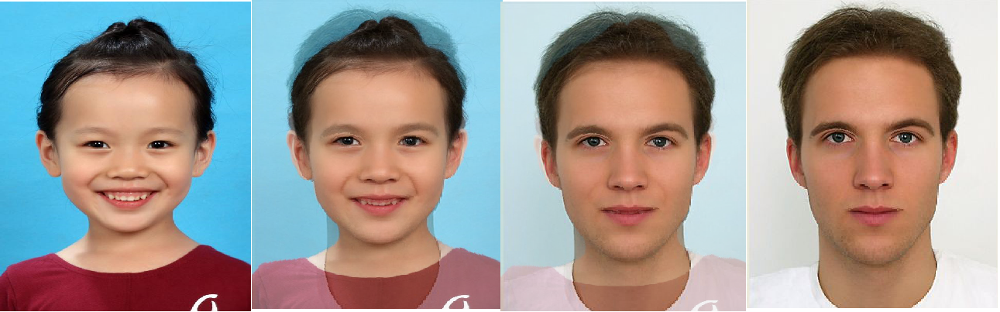

# 计算机视觉 - Homework5

### 姓名：陈明亮

### 学号：16340023


## 一、实验需求

1. 参考课程所给PPT，结合`CImg`库实现`Image Morphing`程序，要求给定输入的两张测试图片，输出两者之间变化的11帧动画视频。

2. 学习相关`Morphing`算法，采用三角剖分`Delaunay`算法，结合两张测试图片的特征点集合，使用`Triangular Mesh`方法完成本次图像变换实验程序。

   ​


## 二、实验步骤解析

1. 首先需要对测试图像进行输入处理，第一步是把两张图像上的人脸特征点进行格式化保存，方便程序的每次运行自动读取数据。
2. `Triangular Mesh`法最重要的一步在于：根据已有的人脸特征点，使用`Delaunay`法进行图像的特征三角形生成，再对生成的每一帧图像进行三角变换(矩阵运算)，从而得到变换过程中的每一帧。
3. 实验中为了减少时间复杂度开销，采用最为方便的`Bowyer-Watson`算法实现`Delaunay`三角剖分
   基本步骤为：

   * 构造一个超级三角形，包含所有散点，放入三角形链表。
   * 将点集中的散点依次插入，在三角形链表中找出外接圆包含插入点的三角形（称为该点的影响三角形），删除影响三角形的公共边，将插入点同影响三角形的全部顶点连接起来，完成一个点在`Delaunay`三角形链表中的插入。
   * 根据优化准则对局部新形成的三角形优化。将形成的三角形放入`Delaunay`三角形链表。
   * 循环执行上述第2步，直到所有散点插入完毕。
4. 进行完三角剖分过程之后，就需要逐帧进行三角仿射变换。根据三角剖分的同构性，我们实际上只需要对当前所需求解的帧中的三角形，分别求出从源图像、最终图像上的对应三角形，到当前的三角形的变换矩阵`transform`，即可对当前三角形内部的所有点进行像素转换。
5. 最后一步就是像素转换的具体方法，此处采用的是一般的线性插值法：$resRGB = (1 - alpha) * srcRGB + alpha * destRGB$


## 三、实验程序简述

Image_Morpher: 图像变形可执行程序，不需要接收任何参数，直接运行。

* 程序运行起始终端标志：`Image Morphing Begin....`，生成时间为10~20秒，结束标志为`Image Morphing End.....`。


* 程序读取`testData`文件夹内部的两张测试图片，将中间帧图像生成放在`frameImg`文件夹。

* `result`文件夹内部存放实验结果视频与`gif`图片，是根据中间帧图像手动使用`ffmpeg`合成的，命令如下：(使用时徐需要进入中间帧图像文件夹)

  ```shell
  ffmpeg -r 8 -i ".\%d.bmp" -vcodec mpeg4 result.mp4  # 合成视频命令

  ffmpeg -r 10 -i ".\%d.bmp" result.gif  # 合成gif命令
  ```

  ​

## 四、实验过程

1. 图像特征点的生成

   方法：结合`Dlib`人脸特征点选取策略，针对本次实验测试图像，采用文本文件记录特征点坐标，运行程序时即读取初始图像特征点坐标，以及最终图像特征点坐标，然后再根据线性插值进行中间帧图像的特征点求解。

   代码：(部分代码)

   ```C++
   // Init middle frames points
   for(int i=0; i<frameNum; i++){
       vector<Point> midTemp;
       float alpha = i / (float)(frameNum-1);
       for(int j=0; j<srcPoints.size(); j++){
       float point_x = (1 - alpha) * srcPoints[j].x + alpha * destPoints[j].x;
       float point_y = (1 - alpha) * srcPoints[j].y + alpha * destPoints[j].y;
       midTemp.push_back(Point(point_x, point_y));
   	}
       midFramePoints.push_back(midTemp);
   }
   ```
   实验结果：

   * `Morphing`源图像特征点选取图

     

   * `Morphing`最终图像特征点选取图

     

     ​


2. 图像三角剖分过程

   方法：使用`Bowyer-Watson`算法，把上一步骤求得的中间帧点集，在求解每一帧的三角形集时逐次处理，根据优化准则`LOP`进行三角形的增加或删除，最终求得每一帧的三角形集合。

   代码：

   * `Image_Morphing.cpp`中使用`Delaunay`类方法构建三角形集

     ```c++
     // Init middle frames triangles
     for(int i=0; i<frameNum; i++){
         vector<Triangle> midTemp;
         Delaunay midMesh(p0, p1, p2, p3);
         for(int j=4; j<midFramePoints[i].size(); j++){
         midMesh.AddPoint(midFramePoints[i][j].x, midFramePoints[i][j].y, 0);
     }
     midFrameMesh.push_back(midMesh);
     // Droping triangles
     for(int j=0; j<midMesh.m_Tris.size(); j++){
         triangle temp = midMesh.m_Tris[j];
         point p0 = midMesh.m_Pts[temp.v[0]], p1 = midMesh.m_Pts[temp.v[1]], p2 = 																	midMesh.m_Pts[temp.v[2]];
         midTemp.push_back(Triangle(Point(p0.x, p0.y), Point(p1.x, p1.y), Point(p2.x, p2.y)));
         }
         midFrameTriangles.push_back(midTemp);
     }
     ```

     ​

   * `Delaunay.cpp`中构建三角形函数，可以看到此处采取了边集记录每个输入的有效边，记为`Delaunay`边。根据该算法的空圆特性，每次构造三角形时必须检测其中是否有其余的点，亦或是其余的三角形，才可以进行下续操作，整个检测以及三角形增加、删除过程被称为`LOP`优化过程(优化过程包含空圆特性保持，禁止三角形外接圆内部有其他的点，否则进行方向抉择，删除该三角形而形成新的该点与原三角形连成的新三角形，或保留原三角形去除该点)。

     ```c++
     void Delaunay::MakeTriangle(int n1, int n2, int n3)
     {
     	double x_centre, y_centre, radius;
     	Cal_Centre(x_centre, y_centre, radius, n1, n2, n3);
     	triangle newTriangle = { { n1,n2,n3 },{ { n1,n2,1 },{ n2,n3,1 },{ n1,n3,1 } 										},x_centre,y_centre,radius, NULL, NULL };
     	m_Tris.push_back(newTriangle);
     	int EdgeSzie = (int)m_Edges.size();
     	int flag;
     	for (int i = 0; i<3; i++)
     	{
     		flag = 1;
     		for (int j = 0; j<EdgeSzie; j++){
     			if (newTriangle.s[i].left == m_Edges[j].left&&newTriangle.s[i].right == 						m_Edges[j].right&&m_Edges[j].count != -1){
                 			flag = 0; m_Edges[j].count += 1; 
                 			break; 
                 }
     			else if (newTriangle.s[i].left == m_Edges[j].left&&newTriangle.s[i].right == 						m_Edges[j].right&&m_Edges[j].count == -1){ 
     						flag = 0;
                				 break; 
                 }
     		}
     		if (flag == 1) m_Edges.push_back(newTriangle.s[i]);
     	}
     }
     ```


   实验结果：

   * `Morphing`源图像三角剖分图像

     

   * `Morphing`最终图像三角剖分图像

     


3. 获取每一帧图像的像素仿射变换矩阵

   方法：我们对上几步获得的三角形进行同构条件下的变换矩阵求解。遍历当前帧的图像，若某一像素点在某个三角形内部，则需要分别求出源图像对应三角形到当前帧三角形的变换矩阵`T1`，以及当前帧三角形到最终图像三角形的变换矩阵`T2`。此处的矩阵运算可以参考以下描述：
   $$
   A =\begin{matrix}
      a_{00} & a_{01} \\
      a_{10} & a_{11}
     \end{matrix}
   , B =\begin{matrix}
     b_0 \\ b_1
     \end{matrix}
    , M = [A B]
    , D1 = T1 * M
    , D2 = T2 * M
    , Res = \begin{matrix} T2 \\ T1 \end{matrix}
   $$
   此处的M为变换前三角形，通常为中间帧三角形输入点构建的矩阵，D1和D2分别为对目标三角形矩阵，分别进行求解所得即为未知的X,Y方向的变换梯度T1和T2，最终取转置输出变换矩阵结果。

   ​

   代码：(部分代码)

   * 判断像素点是否在某一三角形内部(采取同向法判断)

     ```C++
     // Judge whether a point is in the triangle, using core-methods
     bool Image_Morpher::isInTriangle(Point po, Triangle tr){
     	// Judge whether C and P are in the same side of AB
     	Point A = tr.p1, B = tr.p2, C = tr.p3;
     	float x0 = B.x - A.x, x1 = C.x - A.x, x2 = po.x - A.x;
     	float y0 = B.y - A.y, y1 = C.y - A.y, y2 = po.y - A.y;
     	float across_ac = x0 * y1 - y0 * x1, across_cp = x0 * y2 - y0 * x2;
     	bool flag_0 = ((across_ac * across_cp) >= 0);
     	// Judge whether B and P are in the same side of CA
     	x0 = A.x - C.x; x1 = B.x - C.x; x2 = po.x - C.x;
     	y0 = A.y - C.y; y1 = B.y - C.y; y2 = po.y - C.y;
     	float across_ab = x0 * y1 - y0 * x1, across_bp = x0 * y2 - y0 * x2;
     	bool flag_1 = ((across_ab * across_bp) >= 0);
     	// Judge whether A and P are in the same side of BC
     	x0 = C.x - B.x; x1 = A.x - B.x; x2 = po.x - B.x;
     	y0 = C.y - B.y; y1 = A.y - B.y; y2 = po.y - B.y;
     	float across_bc = x0 * y1 - y0 * x1, across_ap = x0 * y2 - y0 * x2;
     	bool flag_2 = ((across_bc * across_ap) >= 0);

     	return flag_0 && flag_1 && flag_2;
     }
     ```

     ​

   * 变换矩阵求解

     ```c++
     // Get transform matrix
     CImg<float> Image_Morpher::getTransformMatrix(Triangle tr1, Triangle tr2){
     	CImg<float> store(3, 3, 1, 1, 1);
     	CImg<float> y0(1, 3, 1, 1, 0), y1(1, 3, 1, 1, 0);
     	CImg<float> trans0(1, 3, 1, 1, 0), trans1(1, 3, 1, 1, 0);
     	CImg<float> result(3, 3, 1, 1, 0);
     	// Initlialize the store matrixes
     	store(0, 0) = tr1.p1.x;  store(0, 1) = tr1.p2.x;  store(0, 2) = tr1.p3.x;
     	store(1, 0) = tr1.p1.y;  store(1, 1) = tr1.p2.y;  store(1, 2) = tr1.p3.y;
     	// Initialize x-dir, y-dir after-triangle vectors
     	y0(0, 0) = tr2.p1.x;  y0(0, 1) = tr2.p2.x;  y0(0, 2) = tr2.p3.x;
     	y1(0, 0) = tr2.p1.y;  y1(0, 1) = tr2.p2.y;  y1(0, 2) = tr2.p3.y;
     	// solve
     	trans0 = y0.solve(store);
     	trans1 = y1.solve(store);

     	for(int i=0; i<3; i++){
     		result(i, 0) = trans0(0, i);
     		result(i, 1) = trans1(0, i);
     	}
     	result(2, 2) = 1;
     	return result;
     }
     ```

     ​

4. 线性插值完成中间帧图像

   方法：最终结合变换矩阵结果，以及源图像，最终图像像素值进行线性插值，生成中间帧。

   代码：

   ```c++
   mid(x, y, 0) = (1-rate) * srcImg(trans0(0, 0), trans0(0, 1), 0) + rate * destImg(trans1(0, 0), trans1(0, 1), 0);
   mid(x, y, 1) = (1-rate) * srcImg(trans0(0, 0), trans0(0, 1), 1) + rate * destImg(trans1(0, 0), trans1(0, 1), 1);
   mid(x, y, 2) = (1-rate) * srcImg(trans0(0, 0), trans0(0, 1), 2) + rate * destImg(trans1(0, 0), trans1(0, 1), 2);
   ```

   ​

5. 最终结果展示

   * 静态转换过程

     

     ​

   * 注：GIF图片与视频文件已放在`result`文件夹内。


## 五、实验感想

1. 本次实验是计算机视觉课程第二次附加作业，总体难度要比上一次附加作业高，其中涉及的知识面比较广，在查阅资料，动手实现的时候也花费了很多时间和精力。

   ​

2. 总体来说本次实验结果不错，自评分为97分。实验过程中也参考了很多文献，逐渐地学习到更多的CV处理知识，对CImg库函数的调用也更加熟悉。在查找资料的同时也看到了很多优秀的处理方法，包括三角形剖分的更优算法，以及图像变形的另外一种，通过画线实现变形的`Beier-Neely`算法，亦或是对人脸特征点识别的自动化生成等等。这其中的每一种算法都是新颖的实现算法，也算是对实验算法内容的拓展，在此其中也收获到了不少，希望能继续保持清醒的头脑，踏实的完成以后的每次作业吧。