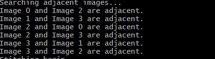
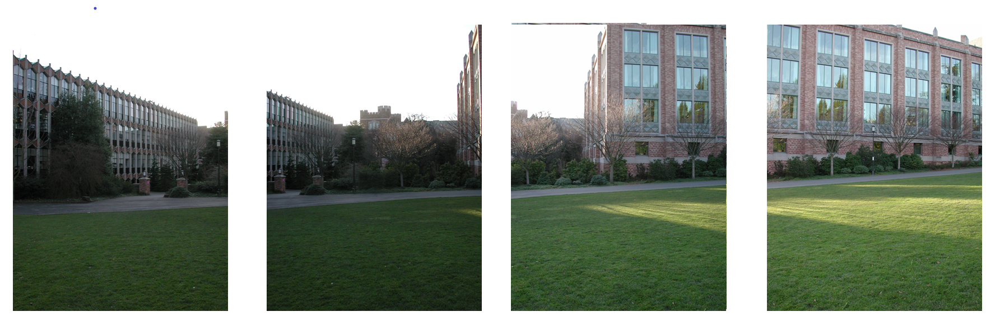
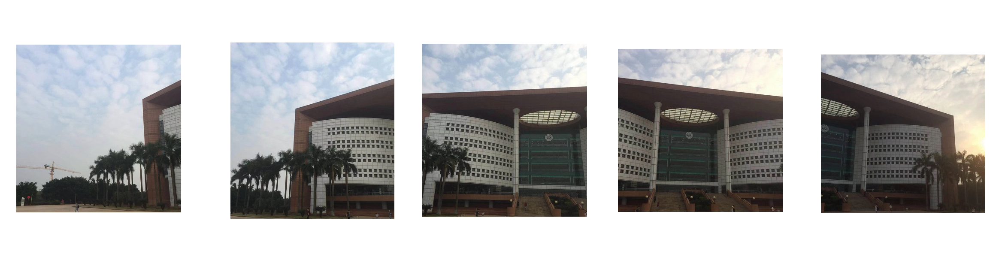
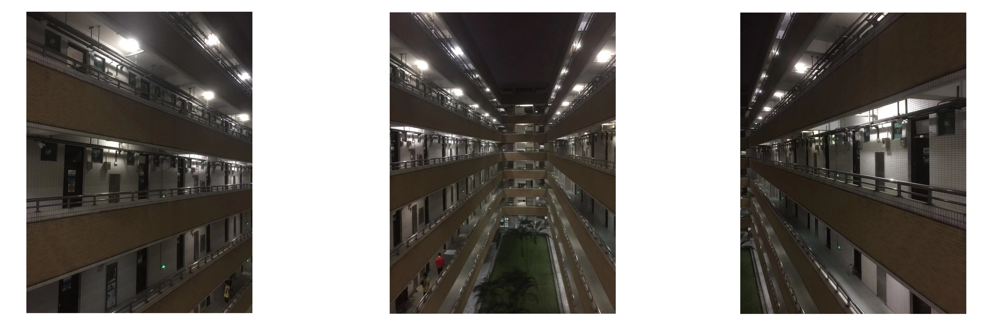
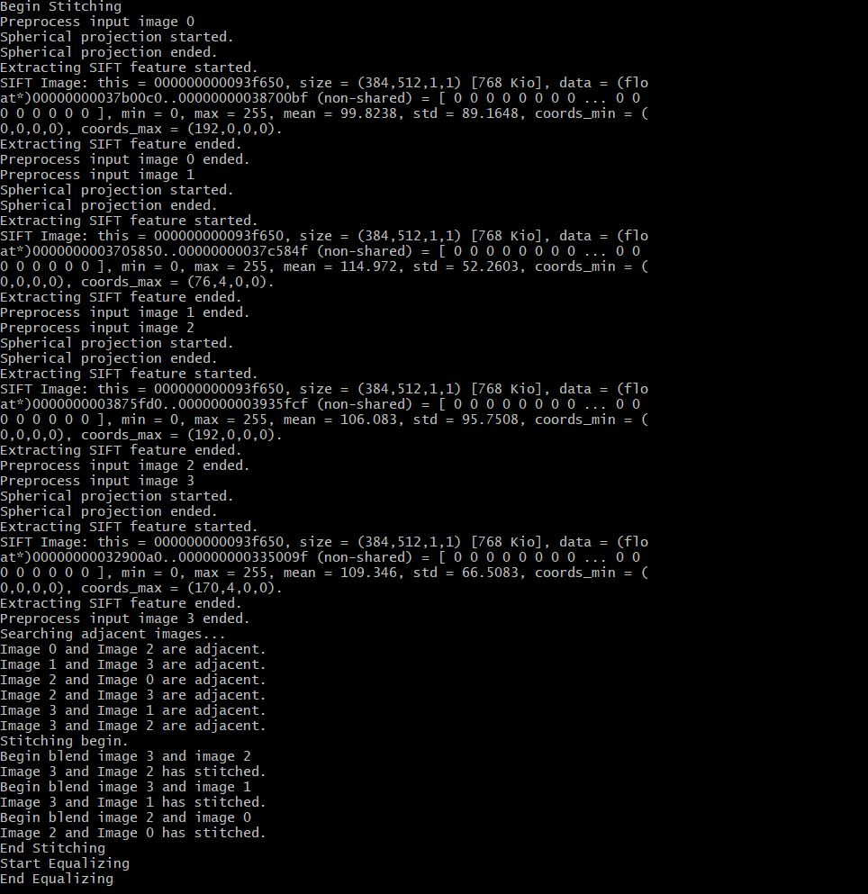

# 计算机视觉 - Homework6

### 姓名：陈明亮

### 学号：16340023


## 一、实验需求
1. 本次作业主题为`全景图像拼接`，要求通过结合课程所给资料，完成作业要求，通过编写C++代码，结合CImg库，最终获得输入多张连续拍摄图片，输出一张全景的拼接图的可执行文件。

2. 作业内容要求逐步执行，步骤大致为：

  * 拍摄相应的连续图，作为测试数据  
  * 进行图像弯曲变换，投影到曲面坐标系上  
  *  进行`SIFT`特征点提取，同时结合`KNN`算法进行特征点配对  
  *  进行随机抽样一致性操作，完成特征点对的映射  
  * 获取相邻特征图像对，根据两者之间对应的特征点对集合，分别进行拼接


  * 获取最终结果图像，进行问题分析与实验报告编写


## 二、实验步骤解析

1. 首先程序扫描输入的图片所在文件夹路径，获取目标文件夹所有的图片，暂存于`vector`内部等待下一步调用。

   ​

2. 进行图像特征点抓取之前的图像弯曲变换，此处结合课程PPT内容将平面图片转换至曲面维度上，此处需要用到图像平面几何变换，进行基本变换之后则需要进行像点分散，保证每个像素点变换后位置的分散性与正确性。

   * 首先我们需要确定球面坐标系的相关坐标参数$(r, \theta, \delta)$，并且根据几何坐标变换法：二元多项式法进行基本的坐标变换，结合二元变换多项式，采用曲面拟合法求出相应的曲面坐标，进行基本坐标变换。
   * 坐标校正之后的像素点有较大几率出现像点积压的情况，此处我们需要对整体变换后的曲面图像进行灰度值内插操作，保证像素点的坐标分散性与正确性。此处采用较为容易实现的一阶插值法：双线性插值法，利用四个领点的灰度值分别在两个方向上作线性内插操作，得出最终处理之后的曲面图。

   ​

3. 对图像弯曲变换之后的图片进行特征点的提取，此处采用的特征点检测算法为`SIFT`算法。`SIFT`算法整体逻辑较为复杂，但大体上可以分为以下几个步骤：

   * 尺度空间的生成

     ​	采用高斯卷积核进行二维图像的尺度空间变换，其中细节包括：对图像进行高斯平滑处理；

     ​	执行下采样操作；生成图像尺度金字塔，DOG金字塔描述不同尺度空间。

   * 检测尺度空间的极值点

     ​	所谓尺度空间的极值点，即相对于那些与其相邻，位于同一图像域与尺度域点的像素值都大或者都小的一部

     ​	分采样点，查询检测极值点的过程依靠DOG金字塔的  `Difference`值进行匹配。

   * 精确定位极值点

     ​	此步主要用于获取极值点位置信息，以及消除DOG算子的曲率不对称，以及强边缘响应问题。

   * 为每个关键点指定方向参数

     ​	通过关键点邻域像素的梯度方向分布特性，为每个关键点指定128维的方向参数，使每个关键点具有原图片

     ​	的旋转不变性。

   * 特征点描述子的生成

     ​	特征点描述子为一组精确描述对应特征点在原图像上的位置、方向等具体信息的唯一向量，主要处理过程分

     ​	为：旋转主方向，生成描述子，以及归一化处理。

   ​

4. 进行输入图像的特征点检测之后，将对应特征点的描述子信息进行存储，进行每张图像的特征点对的匹配`Matching`，根据随机抽样一致性检测`RANSAC`，判断每两张图片之间是否为相邻图像关系。此处同时采用特征点集之间的单应性变换`Homography`，进行单应性矩阵`H`八个自由度参数计算，输出结果，然后随机抽样步骤，最终检测出一致性的特征点对存储到结果点对中。

5. 对每一张图像进行邻居图像的判断，依据为上一步骤的特征点对结果，设定成为邻居图像的特征点对数量阈值，分别确定本图像的前张与后张图像序号，将所得邻居关系存储至关系表中。在开始拼接之前，本步骤执行图像的再一步`Warping`，此步变换是基于邻居关系的最优拼接向量值所得，使得拼接结果中邻居相对位置得以正确显示。


6. 进行邻居图像之间的拼接`Blending`，拼接过程依据两张邻居图片的生成高斯金字塔尺度空间，进行线性插值，分别填充对应位置上的像素点值计算，同时进行两种图片的相对位置移动，移动造成的图像像素值空缺处填0，输出最终拼接图像。


## 三、实验程序简述

1. 可执行程序为`ImageStitching.exe`，接收输入参数为：测试图像所在的路径`path`，测试命令如下：

   ```shell
   $ ./ImageStitching.exe [path]
   ```

   或者可以不接路径参数，改为输入可执行文件名之后，再输入对应文件路径：

   ```shell
   $ ./ImageStitching.exe
   Please enter the image dir path: [path]
   ```

   ​

2. 可执行文件放置在`bin`文件夹内，程序源码位于`src`文件夹，以及`testData1 ~ testData4`文件夹用于存放测试图像，`testBash`文件夹存放测试文件，负责分别调用可执行文件，逐文件夹测试图像，最终输出对应图像拼接结果。`output`文件夹放置每一组图片拼接结果，以及当前程序运行获得的`result.bmp`图片。


3. 实验程序的编译需要`cmake`和`make`环境的配置，倘若需要重新从源代码编译成可执行文件，则需要手动配置好这两者环境，本人已经编写用于`Windows`环境下的`CMakeLists.txt`，简化编译过程，只需要在`src`文件夹下执行:

   ```
   $ cmake -G "MinGW Makefiles" .
   $ make
   ```

   即可免去繁琐的众多`.cpp`的`g++`编译命令输入，减少编译带来的繁琐。


4. 实验程序的运行需要`Vlfeat`环境(老师说可以用于检测相应图像的特征点)，需要下载对应的文件夹，在系统路径里面添加其安装路径。通过测试得知`Vlfeat`官方库对图像特征点的检测进行过优化，执行速度相比于本人之前编写的`SIFT`算法快几倍，于是采用其接口函数支持，但保留之前编写的`SIFT.cpp`源码，包含在`src`文件夹内部。


## 四、实验过程

1. 接收程序输入目标图像文件夹路径，进行初始的输入图像读取。

   方法：通过`Windows`下的文件读取，建立循环依次抓取文件夹内部的图片相对路径，保存到所有有效图片的路径，返回给主程序读取所有图片，依次放入`CImg`图像存储`vector`中。

   代码：(读取有效图片路径函数)

   ```c++
   // Read all images from dir
   vector<string> getTargetImages(string dirPath){
   	vector<string> result;
   	long file = 0;  string path = "";
   	// Define file infos
   	struct _finddata_t fileInfo;
   	if((file = _findfirst(path.assign(dirPath).append("\\*").c_str(), &fileInfo)) != -1){
   		// If can find next, keep looping to push paths into result
   		while(_findnext(file, &fileInfo) == 0){
   			if((fileInfo.attrib & _A_SUBDIR)){
   				if(strcmp(fileInfo.name, ".") != 0 && strcmp(fileInfo.name, "..") != 0){
   					result.push_back(path.assign(dirPath).append("\\")
   								.append(fileInfo.name));
   				}
   			}else {
   				result.push_back(path.assign(dirPath).append("\\").append(fileInfo.name));
   			}
   		}
   		_findclose(file);
   	}
   	return result;
   }
   ```

   ​

2. 进行图像从平面坐标系到曲面坐标系的转换，将图像映射到曲面维度上。

   方法(Step-1)：此处利用曲面坐标变换多项式，首先求出球面坐标第一项`r`，对应方程为`r = (y/2) / tan(15.0 * PI / 180.0)`，然后结合半径数值算出多项式因子：`factor = r / sqrt(r * r + x * x)`，结合因子接着映射坐标数值：`x1 = x / factor, y1 = y / factor`，完成基本的球面坐标变换。

   代码：

   ```c++
   projection_width = src.height();
   projection_height = src.width();

   r = (projection_width / 2.0) / tan(15.0 * PI / 180.0);

   for (int i = 0; i < res.width(); i++) {
   for (int j = 0; j < res.height(); j++) {
   float dst_x = j - projection_width / 2;
   float dst_y = i - projection_height / 2;

   float k = r / sqrt(r * r + dst_x * dst_x);
   float src_x = dst_x / k;
   float src_y = dst_y / k;

   if (src_x + projection_width / 2 >= 0 && src_x + projection_width / 2 < src.height()
   && src_y + projection_height / 2 >= 0 && src_y + projection_height / 2 < src.width()) {
   	for (int k = 0; k < res.spectrum(); k++) {
   		res(i, j, k) = bilinearInterpolate(src, src_y + projection_height / 2, src_x + 						projection_width / 2, k);
   	}
   }
   ```

   方法(Step-2): 进行完基本的坐标变换之后，结合上述的代码我们也看到了双线性插值方法的调用`bilinerInterpolcte`。进行双线性插值的目的在于使曲面像素点处于分散均匀状态，保证变换图像的正确性。双线性插值的具体步骤为：获取对应像素点值，同时根据上下左右四相邻像素点的灰度值，进行两方向的线性插值，获取当前像素点的插值结果并赋值。

   代码：

   ```c++
   unsigned char Utils::bilinearInterpolate(CImg<unsigned char>& image, float x, float y, int 																			chanNum){
   	int x_pos = floor(x);
       float x_u = x - x_pos;
       int xb = (x_pos < image.width() - 1) ? x_pos + 1 : x_pos;

       int y_pos = floor(y);
   	float y_v = y - y_pos;
       int yb = (y_pos < image.height() - 1) ? y_pos + 1 : y_pos;

   	float P1 = image(x_pos, y_pos, chanNum) * (1 - x_u) + image(xb, y_pos, chanNum) * x_u;
   	float P2 = image(x_pos, yb, chanNum) * (1 - x_u) + image(xb, yb, chanNum) * x_u;

       return P1 * (1 - y_v) + P2 * y_v;
   }
   ```


   图像弯曲变换结果(测试图像为dataset1中的图片):

   

   

   

   

   ​

3. 进行弯曲变换之后的图像特征点检测，此处在程序中借助`Vlfeat`库接口函数进行了特征点检测，但实际上本人也有事先实现了对应的`SIFT`算法(经过测试，速度较`Vlfeat`慢3倍左右，于是不考虑继续使用)，所以接下来的代码分析会部分结合原本的`SIFT`算法代码，当然也会对应上`Vlfeat`的相关函数调用。

   方法(Step-1): 特征点尺度空间的生成，首先需要进行对输入图像进行基本的高斯平滑，然后进行降采样操作，逐层构建高斯金字塔与DOG差分金字塔，生成逻辑如下：

   ```c++
   for(int j=1; j<SCALESPEROCTAVE + 3; j++){
       int temp_sigma = sqrt(temp * temp-1) * sigma,
       length = (int)max(3.0f, (float)(2.0 * GAUSSKERN * temp_sigma + 1.0f));
       if(length % 2 == 0) length++;
       sigma = temp * sigma;
       absolute_sigma = sigma * (octaves[i].subSample);
       CImg<float> blurImg = octaves[i].octave[j-1].level.get_blur(temp_sigma);
       octaves[i].octave[j].sigma = sigma;
       octaves[i].octave[j].absolute_sigma = absolute_sigma;
       octaves[i].octave[j].length = length;
       octaves[i].octave[j].level = blurImg;
       CImg<float> res(input.width(), input.height(), 1, 3, 1);
       cimg_forXY(res, x, y){
       	res(x, y) = octaves[i].octave[j].level(x, y) - octaves[i].octave[j-1].level(x, y);
       }
   	DOGoctaves[i].octave[j-1].level = res;
   }
   ```

   分析：此处的高斯平滑采用了`CImg`库自带的`get_blur()`函数，紧接着对`octaves`高斯金字塔进行每一层的初始化，降采样执行结果的赋值，然后对DOG差分进行高斯金字塔的求差，计算元素值。

   `Vlfeat`接口调用代码：

   ```c++
   vl_sift_process_first_octave(siftFilt, imageData)
   vl_sift_process_next_octave(siftFilt)
   ```

   ​

   方法(Step-2): 检测每个尺度空间的极值点，通过探测该点是否比其邻域点像素值都大或者都小，完成极值点检测。同时本函数包含步骤3的精确定位极值点逻辑，通过设定阈值剔除不符合条件极值点。

   ```c++
   if(flag1 || flag2){
       float Dxx = (this->DOGoctaves[i].octave[j].level)(m, n-1) + (this-									>DOGoctaves[i].octave[j].level)(m, n+1) - 2.0 * (this-											>DOGoctaves[i].octave[j].level)(m, n),
       Dyy = (this->DOGoctaves[i].octave[j].level)(m-1, n) + (this->DOGoctaves[i].octave[j].level)					(m+1, n) - 2.0 * (this->DOGoctaves[i].octave[j].level)(m, n),
       Dxy = (this->DOGoctaves[i].octave[j].level)(m-1, n-1) + (this-										>DOGoctaves[i].octave[j].level)(m+1, n+1) - (this->DOGoctaves[i].octave[j].level)					(m+1, n-1) - (this->DOGoctaves[i].octave[j].level)(m-1, n+1);
       float Tri_H = Dxx + Dyy, Det_H = Dxx * Dyy - Dxy * Dxy, ratio = (1.0 * Tri_H * Tri_H) / 			Det_H;
       if(Det_H >= 0.0 && ratio <= cur_threshold){
           this->keyPointsNum++;
           KeyPoint temp;
           temp.width = m * (this->octaves[i].subSample);
           temp.height = n * (this->octaves[i].subSample);
           temp.x  = m;  temp.y = n;
           temp.octave_order = i;  temp.level_order = j;
           temp.scale = (this->octaves[i].octave[j].absolute_sigma);
           this->keyPoint.push_back(temp);
       }
   }
   ```

   分析：此处的flag1与flag2判断邻域关系，判断代码过长此处省去，通过极大值判断flag1或极小值判断flag2，确定当前点是否为极值点，若是则获取相应点位置信息，通过阈值`cur_threshold`，以及计算获得的主曲率`Det_H`，判断是否为符合条件的特征点，通过则加入当前极值点存储队列中。

   `Vlfeat`接口调用代码：

   ```c++
   vl_sift_detect(siftFilt);
   ```

   ​

   方法(Step-3): 根据极值点梯度特性，为每个关键点指定方向参数，使其具有旋转不不变性。

   ```c++
   float road = (2.0 * PI) / 36;
   for(int i=0; i<36; i++){
       if(!binIsKeyPoint[i]) continue;
       int left1 = (i == 0) ? 35 : i-1, right1 = (i+1) % 36;
       float peak, corr, maxPeak1, maxCorr1;
       int ttmp1 = maxBin == 0 ? (36 - 1) : (maxBin - 1);
       bool judgeInterpolate1 = InterpolateOrientation(orientHist[ttmp1], orientHist[maxBin], 
                                                 orientHist[(maxBin + 1) % 36], &corr, &peak);
       if(judgeInterpolate1 == false)
           cout << "[Error] Parabola fitting broken!" << endl;

       float degree = (i + corr) * road - PI;
       if(degree < -PI)
           degree += 2.0 * PI;
       else if(degree > PI)
           degree -= 2.0 * PI;
       // New the keyPoint descriptor
       KeyPoint newPoint;
       newPoint.width = ele.width;
       newPoint.height = ele.height;
       newPoint.x = ele.x;
       newPoint.y = ele.y;
       newPoint.octave_order = ele.octave_order;
       newPoint.level_order = ele.level_order;
       newPoint.scale = ele.scale;
       newPoint.ori = degree;
       newPoint.mag = peak;
       this->keyDescriptors.push_back(newPoint);
   }
   ```

   分析：此步骤篇幅较长，只截取部分代码。为关键点指定方向参数实际上首先需要确定关键点直方图，采用相应的梯度高斯函数计算，然后再进行方向直方图的平滑，最终求取关键点方向，存入当前点信息中。

   `Vlfeat`接口调用代码：

   ```c++
   vl_sift_calc_keypoint_orientations(siftFilt, angles, &tempKeyPoint)
   ```

   ​

   方法(Step-4): 关键点描述子的生成，采用k近邻方法获取相邻像素点的插值结果，运用结果算出128维描述直方图的数值，进行归一化处理，分别计算方向权重，高斯权重，最终获得描述子。

   ```c++
   // Init feature desctiptors
   float desc[128] = {0.0};
   for(int i=0; i<512; i+=2){
       float sx = feat[i], sy = feat[i+1];
       // Interpolcation of nearest-k neighbors
       float st1 = getPixelBi(this->octaves[ele.octave_order].octave[ele.level_order].level, 
       															sx, sy-1),
       st2 = getPixelBi(this->octaves[ele.octave_order].octave[ele.level_order].level, sx-1, sy),
       st3 = getPixelBi(this->octaves[ele.octave_order].octave[ele.level_order].level, sx+1, sy),
       st4 = getPixelBi(this->octaves[ele.octave_order].octave[ele.level_order].level, sx, sy+1);
       // Compute differs, magniture and orientation
       float diff[8] = {0.0};
       float diff_x = st2 - st3, diff_y = st4 - st1;
       float tempMag = sqrt(diff_x * diff_x + diff_y * diff_y), tempGrad = atan(diff_y / diff_x);
       if(tempGrad == PI)
       tempGrad = -PI;
       // Compute weights
       float xWeights[4 * 4], yWeights[4 * 4], posWeights[8 * 4 * 4];
       for(int j=0; j<32; j+=2){
       	xWeights[j/2] = max(0.0f, 1-(fabs(center[j] - sx / 4.0f)));
      		yWeights[j/2] = max(0.0f, 1-(fabs(center[j+1] - sy / 4.0f)));
       }
       for(int a=0; a<16; a++){
       	for(int b=0; b<8; b++)
       		posWeights[a*8+b] = xWeights[a] * yWeights[a];
       }
       // Compute orientation weights
       float orientWeights[128] = {0.0};
       for(int a=0; a<8; a++){
       	float angle = tempGrad - (ele.ori) - orient_angles[a] + PI,
       	halfAngle = angle / (2.0 * PI);
       	// Half-Make
       	angle = angle - (int)(halfAngle) * (2.0 * PI);
            diff[a] = angle - PI;
       }
       // Compute Gaussian weights
       float gaussTemp = exp(-((sx - ele.x) * (sx - ele.x) + (sy - ele.y) * (sy - ele.y)) 
       / (2 * windowSize * windowSize)) / (2 * PI * windowSize * windowSize);
       for(int a=0; a<128; a++){
       	orientWeights[a] = max(0.0f, (float)(1.0 - fabs(diff[a%8]) / orient_spacing * 1.0f));
       	// Compute final desciptors weights
       	desc[a] = desc[a] + orientWeights[a] * posWeights[a] * gaussTemp * tempMag;
       }
   }
   ```

   `Vlfeat`接口调用代码：

   ```c++
   vl_sift_calc_keypoint_descriptor(siftFilt, descriptors, &tempKeyPoint, tempAngle)
   ```

   ​

   此处以`Vlfeat`检测特征点输出图像为步骤结果展示(原步骤进行了灰度处理):

   

   

   

   


4. 完成图像特征点的检测之后，进行随机抽样一致性`RANSAC`，将不同图像的特征点进行配对，识别是否为邻居关系。

   方法(Step-1): 结合`Vlfeat`的`kdtree`，进行特征点对的匹配，然后再进行特征点之间的距离值计算，判断两个特征点之间是否为可匹配点，进而得出两张图之间的匹配点对。

   代码:

   ```c++
   // Scan two images' matched points and make pairs
   vector<keyPointPair> Matcher::scanPointPairs(map<vector<float>, VlSiftKeypoint>& f1, map<vector<float>, VlSiftKeypoint> f2){
   	// Use vlfeat's kdtree
   	VlKDForest* forest = vl_kdforest_new(VL_TYPE_FLOAT, 128, 1, VlDistanceL1);
   	float *data = new float[128 * f1.size()];
   	int k = 0;
   	for (auto it = f1.begin(); it != f1.end(); it++) {
   		const vector<float> &descriptors = it->first;
   		for (int i = 0; i < 128; i++) {
   			data[i + 128 * k] = descriptors[i];
   		}
   		k++;
   	}
   	vl_kdforest_build(forest, f1.size(), data);
   	vector<keyPointPair> res;
   	VlKDForestSearcher* searcher = vl_kdforest_new_searcher(forest);
   	VlKDForestNeighbor neighbours[2];
   	for (auto it = f2.begin(); it != f2.end(); it++){
   		float *temp_data = new float[128];

   		for (int i = 0; i < 128; i++) {
   			temp_data[i] = (it->first)[i];
   		}
   		int nvisited = vl_kdforestsearcher_query(searcher, neighbours, 2, temp_data);
   		float ratio = neighbours[0].distance / neighbours[1].distance;
   		if (ratio < 0.5) {
   			vector<float> des(128);
   			for (int j = 0; j < 128; j++) {
   				des[j] = data[j + neighbours[0].index * 128];
   			}

   			VlSiftKeypoint left = f1.find(des)->second;
   			VlSiftKeypoint right = it->second;
   			res.push_back(keyPointPair(left, right));
   		}

   		delete[] temp_data;
   		temp_data = NULL;
   	}
   	vl_kdforestsearcher_delete(searcher);
   	vl_kdforest_delete(forest);
   	delete[] data;
   	data = NULL;
   	return res;
   }
   ```

   ​

   方法(Step-2): 设定阈值，若两张图像之间匹配成功的特征点对超过了阈值，则认定为邻居关系。接下来就是根据`RANSAC`算法循环查找邻居图片之间的连接最优线段了，也就是最优`Matching Vector`的查找。

   代码：

   ```c++
   // RANSAC Implementing
   Axis Matcher::RANSAC(vector<keyPointPair>& pairs){
   	srand(time(0));

   	// Belive confidence, inline_ratio and make pair num to calculate turn number
   	float conf = 0.99, inlineRate = 0.5;
   	int pairNum = 4;
   	int turns = ceil(log(1 - conf) / log(1 - pow(inlineRate, pairNum)));
   	vector<int> max_inliner_indexs;
   	while (turns--) {
   		vector<keyPointPair> random_pairs;
   		set<int> indexs;

   		for (int i = 0; i < NUM_OF_PAIR; i++) {
   			int index = random(0, pairs.size() - 1);
   			while (indexs.find(index) != indexs.end()) {
   				index = random(0, pairs.size() - 1);
   			}
   			indexs.insert(index);

   			random_pairs.push_back(pairs[index]);
   		}
   		Axis H = Homography(random_pairs);
   		vector<int> cur_inliner_indexs = getInlinerIndexs(pairs, H, indexs);
   		if (cur_inliner_indexs.size() > max_inliner_indexs.size()) {
   			max_inliner_indexs = cur_inliner_indexs;
   		}
   	}
   	Axis t = leastSquares(pairs, max_inliner_indexs);
   	return t;
   }
   ```

   分析：`RANSAC`函数接收某两张图片的匹配点对，秉承随机抽样的做法，在点对里面随机抽取对应数量的匹配点对，进行循环部分。循环部分主要执行单应性变换，得取变换矩阵H，用于计算所有`inliner`的数量，并且存储在集合内。完成循环部分之后，执行最小二乘操作，反复计算变换矩阵H，直到毕竟最优连接向量，返回对应向量元素。

   ```c++
   // Image homography matching
   Axis Matcher::Homography(vector<keyPointPair>& pair){
   	CImg<float> A(4, 4, 1, 1, 0);
   	CImg<float> b(1, 4, 1, 1, 0);
   	for(int i=0; i<4; i++){
   		A(0, i) = pair[i].p1.x;  A(1, i) = pair[i].p1.y;
   		A(2, i) = pair[i].p1.x * pair[i].p1.y;
   		A(3, i) = 1;
   		b(0, i) = pair[i].p2.x;
   	}
   	CImg<float> temp1 = b.get_solve(A);
   	for(int i=0; i<4; i++)
   		b(0, i) = pair[i].p2.y;
   	CImg<float> temp2 = b.get_solve(A);
   	return Axis(temp1(0, 0), temp1(0, 1), temp1(0, 2), temp1(0, 3), temp2(0, 0), 
   		temp2(0, 1), temp2(0, 2), temp2(0, 3));
   }
   ```

   程序测试获取相邻图片结果：

   

   ​

   ​

5. 读入邻居关系图像，分别调用其对应的`Warping vector`(即上一步骤求解的最优拼接向量)，变换图像使得拼接时能够处于正确的相对位置。

   代码：

   ```c++
   // Warp destination image by homography
   wr.warpImage(src[dstIndex], temp1, backward, min_x, min_y);
   // Move stitched image offset
   wr.moveImageByOffset(curr, temp2, min_x, min_y);

   // Start-up of warping, using homography
   void Warper::warpImage(CImg<unsigned char> &src, CImg<unsigned char> &dst, Axis ax, int offset_x, int offset_y){
   	cimg_forXY(dst, x, y){
   		int src_x = getXAfterWarping(x + offset_x, y + offset_y, ax),
   			src_y = getYAfterWarping(x + offset_x, y + offset_y, ax);
   		if(src_x >= 0 && src_x < src.width() && src_y >= 0 && src_y < src.height()){
   			for(int i=0; i<src.spectrum(); i++)
   				dst(x, y, i) = ut.bilinearInterpolate(src, src_x, src_y, i);
   		}
   	}
   }

   // Must move images to fix best after warping
   void Warper::moveImageByOffset(CImg<unsigned char> &src, CImg<unsigned char> &dst, float offset_x, float offset_y){
   	cimg_forXY(dst, x, y){
   		int src_x = x + offset_x, src_y = y + offset_y;
   		if(src_x >= 0 && src_x < src.width() && src_y >= 0 && src_y < src.height()){
   			for(int i=0; i<src.spectrum(); i++)
   				dst(x, y, i) = src(src_x, src_y, i);
   		}
   	}
   }
   ```

   分析：进行图像的基于邻居关系的位置变换时，不仅要考虑其相对于拼接变量的像素值变换(此处仍采用双线性插值)，还要考虑其相对位置的变换`moveImageByOffset`，适当对空缺位置补黑。


6. 进行最终图像拼接操作`Blending`，拼接操作需要用到双方输入图像的基本图像高斯金字塔值，进行基于高斯金字塔的图像拼接(带掩核)，分配相应权重，同时操作结果图像像素值，输出最终结果。

   代码：(部分代码)

   ```c++
   // Resizing and filling empty spaces with black
   CImg<float> res = blend_pyramid[n_level - 1];
   for (int i = n_level - 2; i >= 0; i--) {
   	res.resize(blend_pyramid[i].width(), blend_pyramid[i].height(), 1, 									blend_pyramid[i].spectrum(), 3);
   for (int x = 0; x < blend_pyramid[i].width(); x++) {
   	for (int y = 0; y < blend_pyramid[i].height(); y++) {
   		for (int k = 0; k < blend_pyramid[i].spectrum(); k++) {
   			float temp = res(x, y, k) + blend_pyramid[i](x, y, k);
   			if (temp > 255) {
   				temp = 255;
   			}
   			else if (temp < 0) {
   				temp = 0;
   			}
   			res(x, y, k) = temp;
   		}
   	}
   }
   }
   ```


7. 此步骤为本人新增步骤，鉴于最终的拼接结果有时候会含有小面积阴影，实际上是因为不论是SIFT操作，还是拼接图像时没有都对亮度进行均衡化，导致最终拼接结果有些阴影部分(实际上面积挺小，不阻碍拼接正确性)。此处结合直方图均衡化，采用`YCbCr`对结果图像进行亮度均衡化，得到优化结果。

   代码：

   ```c++
   // Final equalization
   cout << "Start Equalizing" << endl;
   Equalizater ez(stitchedResult);
   CImg<unsigned char> result = ez.Equalization();
   cout << "End Equalizing" << endl;
   ```

   ​

## 五、实验结果展示

1. 测试用例1(dataset1)

   原图像：

   

   程序执行结果：

   


2. 测试用例2(dataset2)

   原图像：(非排序)

   

   程序执行结果：

   

   ​

3. 测试用例3(dataset3)

   原图像：

   

   程序执行结果：

   


4. 测试用例4(dataset4):

   原图像：

   

   程序执行结果：

   


5. 程序执行过程图(测试样例1)

   


6. 注：所有的测试样例结果图片均在文件夹`output`中，可自行查看。


## 六、实验感想

1. 此次实验算是继几个小作业之后的第一次大型作业了吧，不论是规模上还是难度上都跟之前的作业截然不同，难度方面是挺高的，在本作业上花费的时间也是十分多，期间遇到的错误也是数不胜数，但总算是通过自己的努力，逐个解决了，最终得出的实验结果也算是不错，此处自评95分。
2. 本次实验带来的提升还是蛮大的，不论是对`SIFT`算法步骤的认识，还是图像拼接方面的各种知识，都能算是比较熟悉了，希望能够加油，在以后的作业上更加大展身手吧。